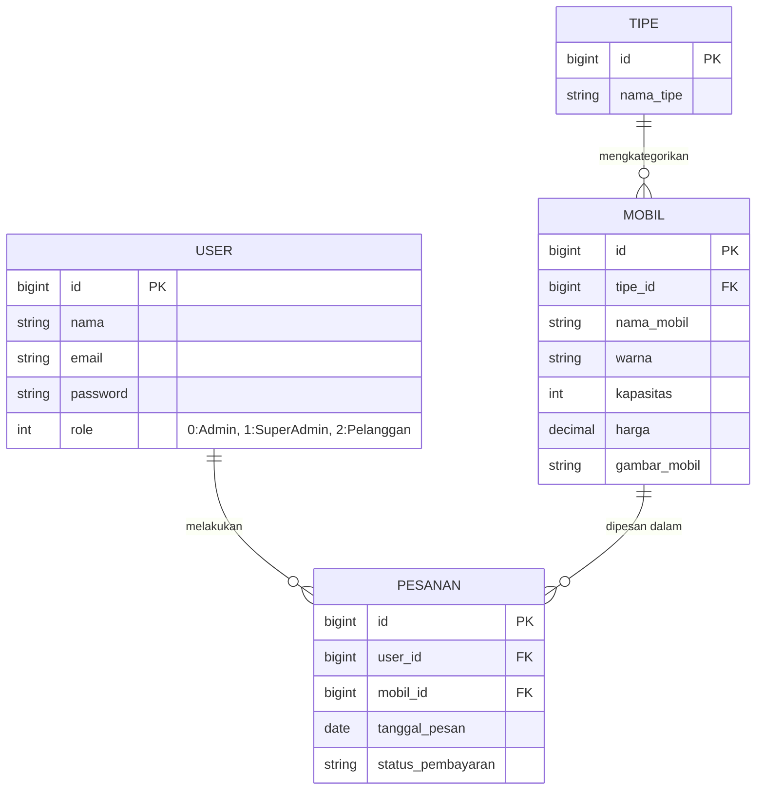
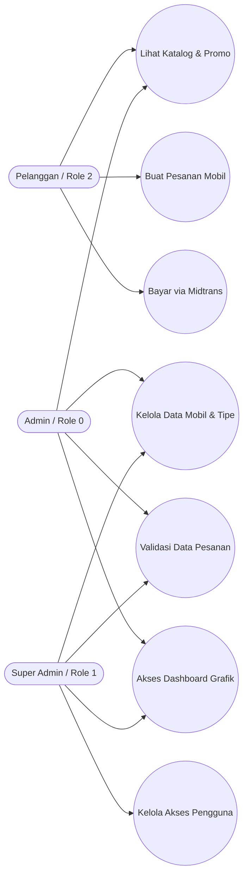

Pilihan yang sangat brilian! Daripada repot menggambar di aplikasi terpisah (seperti Visio atau Draw.io) lalu mengekspornya sebagai gambar, kita bisa menggunakan **Mermaid.js**.

Berita baiknya: **GitHub secara otomatis mendukung kode Mermaid!** Jadi, Anda cukup menyalin kode di bawah ini, dan GitHub akan langsung menyulapnya menjadi diagram visual yang interaktif dan sangat profesional di halaman repositori Anda.

Berikut adalah versi final `README.md` Anda, lengkap dengan visualisasi ERD dan Use Case Diagram yang siap pakai:

---

### Salin Kode di Bawah Ini ke dalam file `README.md` Anda:

````markdown
# 🚗 Sigma Automobil (Sistem Informasi Penjualan Mobil)

Sigma Automobil adalah aplikasi web sistem informasi dealer mobil modern yang dibangun menggunakan framework Laravel. Aplikasi ini dirancang untuk memudahkan pelanggan dalam mencari katalog mobil, melakukan pemesanan (SPK), dan melakukan pembayaran _Booking Fee_ secara otomatis, sekaligus memberikan kemudahan bagi manajemen dealer melalui _Dashboard Admin_ yang komprehensif.

## 🛠️ Teknologi yang Digunakan

- **Framework:** Laravel (PHP)
- **Frontend:** Bootstrap 5, HTML, CSS (Classic Modern UI)
- **Database:** MySQL
- **Payment Gateway:** Midtrans (Sandbox)
- **Authentication:** Google OAuth 2.0 (SSO)
- **Grafik/Visualisasi:** Chart.js

## ✨ Fitur Unggulan

- **Sistem Otentikasi Ganda:** Pengguna dapat mendaftar secara manual atau masuk cepat menggunakan Akun Google (Single Sign-On).
- **Payment Gateway Otomatis:** Integrasi Midtrans Snap untuk pembayaran _Booking Fee_ yang otomatis mengubah status pesanan.
- **Dashboard Analitik:** Visualisasi data pesanan dan penjualan menggunakan grafik Chart.js secara _real-time_.
- **Manajemen Katalog:** Admin dapat mengatur tipe, merk, harga, dan gambar mobil dengan mudah.
- **Member Area Premium:** Halaman profil pelanggan untuk memantau status pesanan mereka.

## 📸 Tangkapan Layar (Screenshots)

_(Segera Hadir - Akan diperbarui dengan tangkapan layar Beranda, Katalog, dan Dashboard Admin)_

---

## 📊 Pemodelan Sistem (UML & ERD)

### 1. Entity Relationship Diagram (ERD) & Logical Record Structure (LRS)

Diagram di bawah ini merepresentasikan struktur relasi antar tabel dalam basis data Sigma Automobil.


````

### 2. Use Case Diagram

Menggambarkan interaksi hak akses (_role_) dengan fitur-fitur yang ada di dalam sistem.



---

## 👥 Role & Akses (Hak Akses)

Sistem ini menggunakan _middleware_ untuk membatasi akses:

1. **Super Admin (Role 1):** Memiliki akses penuh ke seluruh sistem, grafik analitik, dan manajemen tingkat _User_.
2. **Admin (Role 0):** Memiliki akses ke pengelolaan data operasional dealer (katalog mobil, tipe, dan validasi pesanan).
3. **Pelanggan (Role 2):** Akses ke area publik (katalog, promosi), pemesanan mobil, pembayaran Midtrans, dan Member Area.

**Kredensial Testing Default:**

- **Akun Admin:** `admin@sigmaautomobil.com` | Password: `password`

---

## 🚀 Panduan Instalasi (Local Setup)

Ikuti langkah-langkah berikut untuk menjalankan proyek ini di _local environment_ (Laragon/XAMPP):

1. **Clone Repositori**

    ```bash
    git clone [https://github.com/username-anda/sigma-automobil.git](https://github.com/username-anda/sigma-automobil.git)
    cd sigma-automobil
    ```

2. **Install Dependencies**

    ```bash
    composer install
    npm install && npm run build
    ```

3. **Setup Environment (.env)**
    - Duplikat file `.env.example` menjadi `.env`.
    - Sesuaikan koneksi database Anda:
        ```env
        DB_CONNECTION=mysql
        DB_HOST=127.0.0.1
        DB_PORT=3306
        DB_DATABASE=db_sigma_automobil
        DB_USERNAME=root
        DB_PASSWORD=
        ```
    - **PENTING:** Masukkan API Key Midtrans & Client ID Google OAuth Anda di konfigurasi `.env`.

4. **Generate Application Key & Migrasi Database**

    ```bash
    php artisan key:generate
    php artisan migrate --seed
    ```

5. **Jalankan Server Lokal**
    ```bash
    php artisan serve
    ```
    Buka `http://localhost:8000` di browser Anda.
