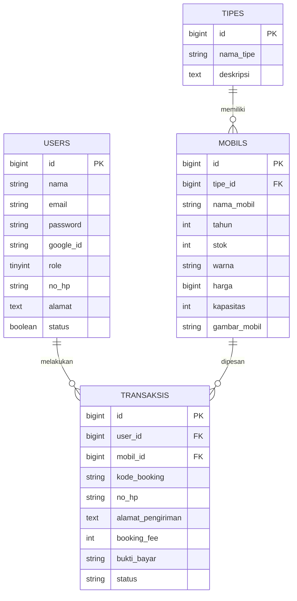
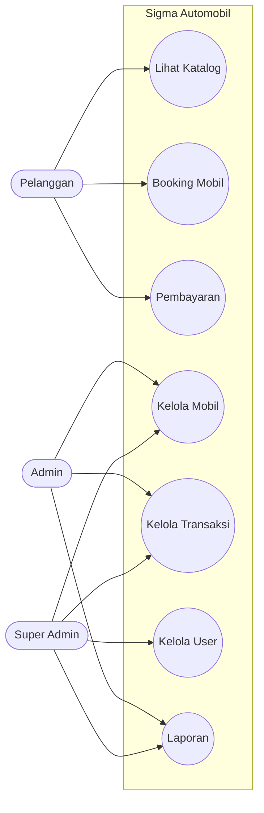
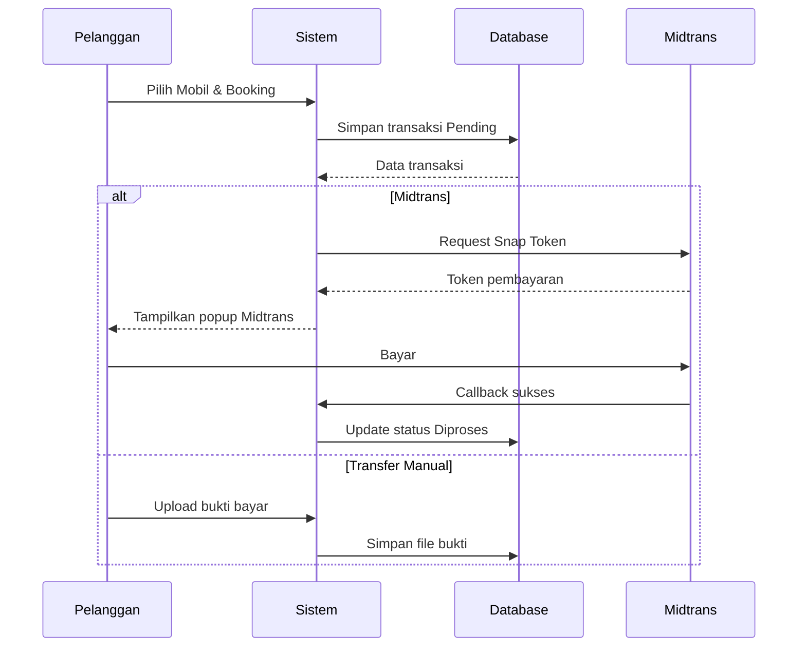
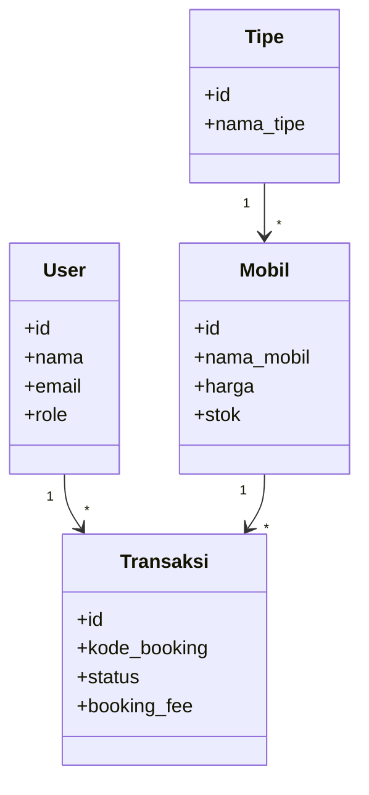

````markdown
# 🚗 Sigma Automobil — Sistem Informasi Dealer Mobil Terintegrasi


**Sigma Automobil** adalah aplikasi web berbasis **Laravel** untuk mendukung proses penjualan dan pemesanan kendaraan secara digital. Sistem dirancang agar pelanggan dapat mencari mobil, melakukan _booking_, membayar _booking fee_, hingga memantau status transaksi secara online.

Selain itu, tersedia **Dashboard Admin** untuk mengelola data mobil, tipe kendaraan, transaksi pelanggan, serta manajemen pengguna secara terpusat.

---

# ✨ Fitur Unggulan

## 🔐 1. Login Modern (Google SSO)

Pengguna dapat mendaftar manual atau login instan menggunakan **Google OAuth 2.0**.

## 💳 2. Sistem Pembayaran Hybrid

Mendukung dua metode pembayaran:

- **Midtrans Snap API** (otomatis)
- **Transfer Manual** dengan upload bukti bayar

## 🚘 3. Katalog Mobil Dinamis

Menampilkan daftar mobil lengkap dengan:

- Tipe kendaraan
- Tahun produksi
- Harga
- Warna
- Kapasitas penumpang
- Status stok

## 👤 4. Member Dashboard

Pelanggan dapat melihat:

- Riwayat booking
- Status transaksi
- Detail kendaraan yang dipesan
- Profil akun

## 🛡️ 5. Role Based Access Control

Hak akses dibedakan menjadi:

- **Super Admin**
- **Admin**
- **Pelanggan**

## 🎨 6. UI/UX Responsif

Antarmuka modern, ringan, dan nyaman di desktop maupun mobile.

---

# 📸 Screenshot

> Tambahkan gambar tampilan aplikasi pada bagian ini.

- Beranda & Katalog Mobil
- Login Google
- Dashboard Admin
- Form Booking
- Pembayaran Midtrans
- Upload Bukti Transfer

---

# 📊 Pemodelan Sistem (UML)

## 1️⃣ Entity Relationship Diagram (ERD)


````

---

## 2️⃣ Use Case Diagram



---

## 3️⃣ Sequence Diagram — Booking Mobil



---

## 4️⃣ Class Diagram



---

# 📁 Struktur Folder

```text
sigma-automobil/
├── app/
│   ├── Http/Controllers/
│   │   ├── Frontend/
│   │   └── Backend/
│   └── Models/
│
├── resources/views/
│   ├── frontend/
│   └── backend/
│
├── routes/
│   └── web.php
│
├── database/
│   ├── migrations/
│   └── seeders/
│
└── public/
```

---

# 👥 Akun Demo

| Role        | Email                  | Password   |
| ----------- | ---------------------- | ---------- |
| Super Admin | `superadmin@gmail.com` | `password` |
| Admin       | `ichwan@gmail.com`     | `password` |
| Pelanggan   | `mario@gmail.com`      | `password` |

---

# 🚀 Instalasi

## Persyaratan

- PHP >= 8.1
- Composer 2.x
- MySQL / MariaDB
- Node.js & NPM

---

## 1. Clone Repository

```bash
git clone https://github.com/USERNAME_ANDA/sigma-automobil.git
cd sigma-automobil
```

---

## 2. Install Dependency

```bash
composer install
npm install
npm run build
```

---

## 3. Konfigurasi Environment

```bash
cp .env.example .env
```

Isi file `.env`

```env
APP_NAME="Sigma Automobil"

DB_CONNECTION=mysql
DB_HOST=127.0.0.1
DB_PORT=3306
DB_DATABASE=db_project_penjualan_mobil
DB_USERNAME=root
DB_PASSWORD=

MIDTRANS_SERVER_KEY=your_server_key
MIDTRANS_CLIENT_KEY=your_client_key

GOOGLE_CLIENT_ID=your_google_client_id
GOOGLE_CLIENT_SECRET=your_google_client_secret
```

---

## 4. Generate Key & Migrasi Database

```bash
php artisan key:generate
php artisan migrate:fresh --seed
```

---

## 5. Storage Link

```bash
php artisan storage:link
```

---

## 6. Jalankan Server

```bash
php artisan serve
```

Buka browser:

```text
http://127.0.0.1:8000
```

---

# 🛠️ Teknologi yang Digunakan

- Laravel
- Bootstrap
- MySQL
- JavaScript
- Midtrans API
- Google OAuth
- Blade Template Engine

---

# 👨‍💻 Developer

Dibuat untuk keperluan **Project Web Programming 3**
© 2026 **Sigma Automobil**

```

```
