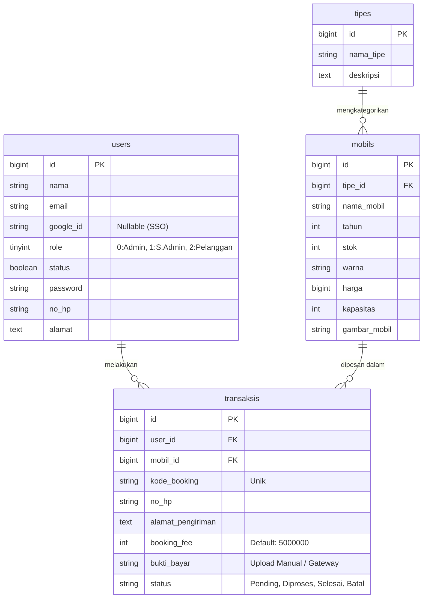
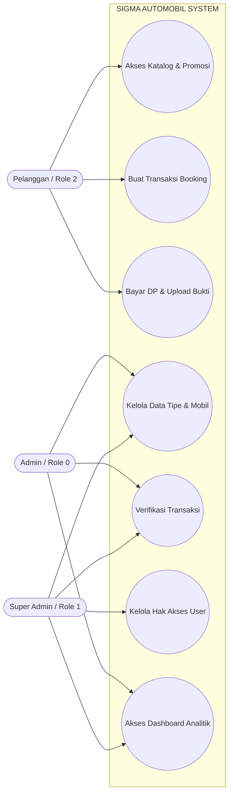
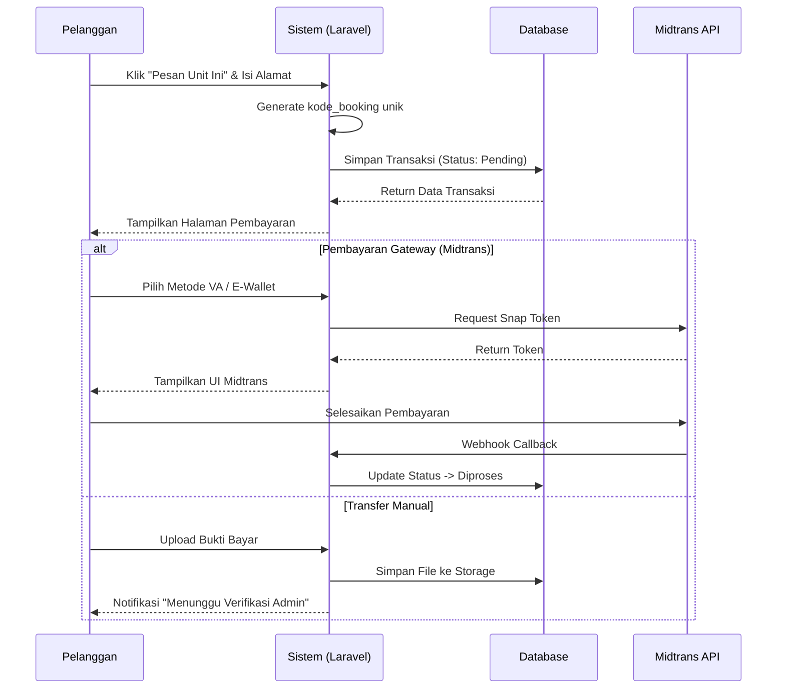
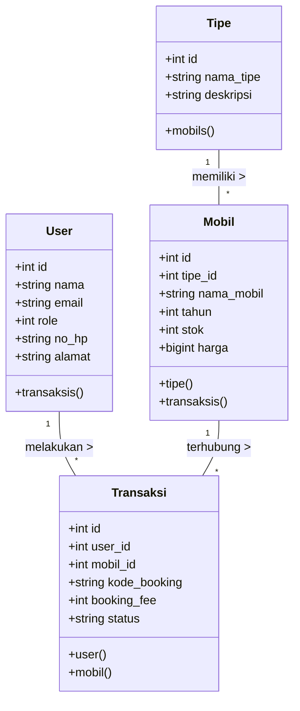

Saya sudah perbaiki README kamu agar lebih konsisten, rapi, dan profesional. Berikut versi yang sudah dioptimalkan:

````markdown
# 🚗 Sigma Automobil - Sistem Informasi Dealer Mobil Terintegrasi


**Sigma Automobil** adalah aplikasi web sistem informasi penjualan dan pemesanan mobil modern. Sistem ini memfasilitasi pelanggan dari tahap pencarian katalog armada, pemesanan (SPK), hingga penyelesaian transaksi _Booking Fee_ secara aman. Mendukung metode pembayaran otomatis (Midtrans) maupun unggah bukti transfer manual, serta dilengkapi dengan _Admin Dashboard_ berkinerja tinggi untuk operasional dealer.

---

## ✨ Fitur Utama

1. **Autentikasi Modern (SSO):** Registrasi manual atau _login_ instan dengan integrasi **Google OAuth 2.0**.
2. **Sistem Pembayaran Hibrida:** Integrasi **Midtrans Snap API** untuk validasi otomatis + opsi transfer manual dengan unggah bukti bayar.
3. **Katalog Armada Dinamis:** Filter cerdas berdasarkan tipe mobil, lengkap dengan detail unit (tahun, stok, kapasitas, harga).
4. **Member Area Premium:** Dashboard pelanggan untuk melacak riwayat transaksi (Pending, Diproses, Selesai, Batal) menggunakan `kode_booking`.
5. **Role-Based Access Control (RBAC):** Pemisahan otoritas antara Pelanggan, Admin, dan Super Admin.
6. **UI/UX Modern:** Antarmuka bersih, responsif, dan profesional untuk pengalaman terbaik.

---

## 📸 Tangkapan Layar

_(Segera diperbarui – tempatkan screenshot aplikasi di sini)_

- Beranda & Katalog
- Form Login & Google SSO
- Admin Dashboard
- Form Pemesanan & Pembayaran

---

## 📊 Arsitektur & Pemodelan Sistem (UML)

### 1. Entity Relationship Diagram (ERD)

Relasi antar entitas database.


````

### 2. Use Case Diagram

Interaksi aktor dengan sistem.



### 3. Sequence Diagram: Alur Transaksi Booking



### 4. Class Diagram (Model MVC)



---

## 📁 Struktur Direktori

```text
sigma-automobil/
├── app/
│   ├── Http/Controllers/
│   │   ├── Frontend/     # Logika bisnis halaman pengunjung & member
│   │   └── Backend/      # Logika bisnis dashboard admin
│   └── Models/           # Struktur Database (User, Mobil, Tipe, Transaksi)
├── routes/
│   └── web.php           # Routing & Middleware
└── resources/
    └── views/
        ├── frontend/     # Tampilan publik & keranjang
        └── backend/      # Tampilan Admin Panel
```

---

## 👥 Kredensial Testing

| Role                | Akses                                       | Email                  | Password   |
| :------------------ | :------------------------------------------ | :--------------------- | :--------- |
| **Super Admin (1)** | Semua fitur + Data User                     | `superadmin@gmail.com` | `password` |
| **Admin (0)**       | Operasional armada & verifikasi bukti bayar | `ichwan@gmail.com`     | `password` |
| **Pelanggan (2)**   | Halaman utama, booking, unggah bukti        | `mario@gmail.com`      | `password` |

---

## 🚀 Panduan Instalasi

### Persyaratan

- PHP >= 8.1
- Composer 2.x
- MySQL / MariaDB
- Node.js & NPM

### Langkah

1. **Clone Repo**

    ```bash
    git clone https://github.com/USERNAME_ANDA/sigma-automobil.git
    cd sigma-automobil
    ```

2. **Install Dependencies**

    ```bash
    composer install
    npm install && npm run build
    ```

3. **Konfigurasi Environment**

    ```bash
    cp .env.example .env
    ```

    Sesuaikan `.env`:

    ```env
    DB_CONNECTION=mysql
    DB_HOST=127.0.0.1
    DB_PORT=3306
    DB_DATABASE=db_project_penjualan_mobil
    DB_USERNAME=root
    DB_PASSWORD=

    MIDTRANS_SERVER_KEY=SB-Mid-server-xxxxxxxxxxxx
    MIDTRANS_CLIENT_KEY=SB-Mid-client-xxxxxxxxxxxx

    GOOGLE_CLIENT_ID=xxxxxxxxxxxx.apps.googleusercontent.com
    GOOGLE_CLIENT_SECRET=xxxxxxxxxxxx
    ```

4. **Generate Key & Migrasi**
    ```bash
    php artisan key
    ```
