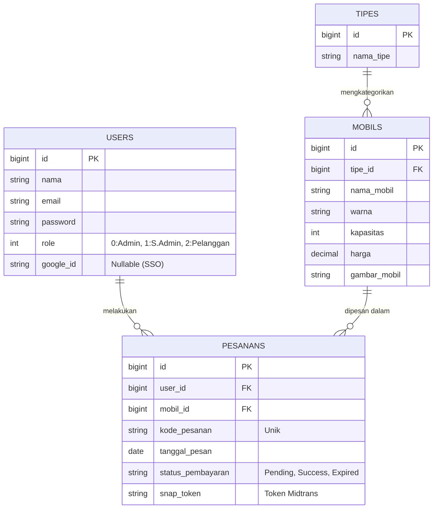
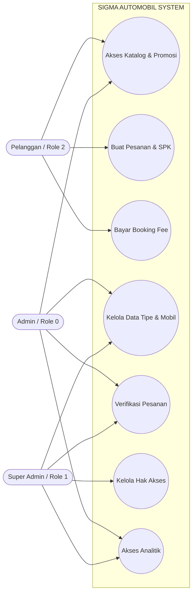
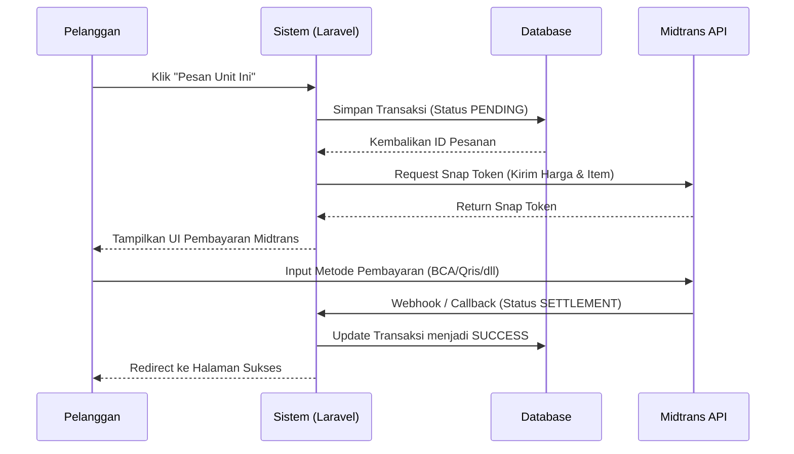
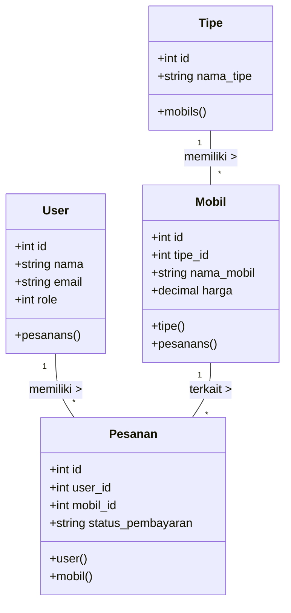

````markdown
# 🚗 Sigma Automobil - Sistem Informasi Dealer Mobil Terintegrasi


**Sigma Automobil** adalah aplikasi web sistem informasi penjualan dan pemesanan mobil modern. Sistem ini memfasilitasi pelanggan dari tahap pencarian katalog armada, pemesanan (SPK), hingga penyelesaian transaksi _Booking Fee_ secara aman dan instan menggunakan Payment Gateway. Dilengkapi dengan _Admin Dashboard_ berkinerja tinggi untuk operasional dealer.

---

## ✨ Fitur Unggulan

1. **Autentikasi Modern (SSO):** Pengguna dapat mendaftar secara manual atau _login_ instan dengan sekali klik menggunakan integrasi **Google OAuth 2.0**.
2. **Automated Payment Gateway:** Terintegrasi langsung dengan **Midtrans Snap API**. Pembayaran DP/Booking Fee divalidasi secara otomatis melalui sistem _Webhook/Callback_.
3. **Katalog Armada Dinamis:** Filter cerdas berdasarkan tipe mobil, dilengkapi manajemen status ketersediaan unit.
4. **Member Area:** Dashboard khusus bagi pelanggan untuk melacak riwayat transaksi dan status pesanan.
5. **Role-Based Access Control (RBAC):** Sistem manajemen akses ketat yang memisahkan otoritas antara Pelanggan, Admin (Operasional), dan Super Admin (Manajemen).

---

## 📸 Tangkapan Layar (Screenshots)

_(Akan diperbarui - Tempatkan screenshot aplikasi di sini)_

- `[Screenshot Beranda & Katalog]`
- `[Screenshot Form Login & Google SSO]`
- `[Screenshot Admin Dashboard]`
- `[Screenshot Pop-up Pembayaran Midtrans]`

---

## 📊 Arsitektur & Pemodelan Sistem (UML)

Diagram di bawah ini dirender secara otomatis menggunakan sintaks Mermaid.js untuk memetakan alur bisnis Sigma Automobil.

### 1. Entity Relationship Diagram (ERD) & Logical Record Structure (LRS)

Mendeskripsikan rancangan basis data dan relasi antar entitas kunci.


````

### 2. Use Case Diagram

Memetakan batas interaksi antara aktor (Pelanggan, Admin, Super Admin) dengan sistem.



### 3. Sequence Diagram: Alur Pemesanan & Pembayaran (Midtrans)

Menggambarkan interaksi _real-time_ objek dari sisi klien, server, database, hingga pihak ketiga (API).



### 4. Class Diagram (Model MVC)

Representasi relasi struktur kode Object-Oriented pada Model Laravel.



---

## 📁 Struktur Direktori Utama

Proyek ini mengadopsi pemisahan folder yang ketat antara _Frontend_ (Pengunjung) dan _Backend_ (Admin Panel).

```text
sigma-automobil/
├── app/
│   ├── Http/Controllers/
│   │   ├── Frontend/     # Logika bisnis untuk halaman pengunjung & member
│   │   └── Backend/      # Logika bisnis untuk dashboard admin
│   └── Models/           # Struktur Database (User, Mobil, Tipe, Pesanan)
├── routes/
│   └── web.php           # Konfigurasi routing & Middleware
└── resources/
    └── views/
        ├── frontend/     # Tampilan (UI) publik & keranjang
        └── backend/      # Tampilan (UI) Admin Panel
```

---

## 👥 Hak Akses Kredensial (Testing)

| Role                | Keterangan Akses                   | Email Default          | Password   |
| :------------------ | :--------------------------------- | :--------------------- | :--------- |
| **Super Admin (1)** | Akses seluruh fitur + Data User    | `superadmin@gmail.com` | `password` |
| **Admin (0)**       | Akses operasional armada & pesanan | `ichwan@gmail.com`     | `password` |
| **Pelanggan (2)**   | Akses halaman utama & _checkout_   | `mario@gmail.com`      | `password` |

*(Gunakan email di atas untuk pengujian, atau jalankan seeder untuk *generate* ulang data).*

---

## 🚀 Panduan Instalasi (Local Development)

Ikuti instruksi berikut untuk menjalankan proyek ini di mesin lokal Anda:

### Persyaratan Sistem

- PHP >= 8.1
- Composer 2.x
- MySQL / MariaDB
- Node.js & NPM

### Langkah Instalasi

1. **Kloning Repositori**

    ```bash
    git clone [https://github.com/USERNAME_ANDA/sigma-automobil.git](https://github.com/USERNAME_ANDA/sigma-automobil.git)
    cd sigma-automobil
    ```

2. **Install Library & Dependencies**

    ```bash
    composer install
    npm install && npm run build
    ```

3. **Konfigurasi Environment**
   Salin file konfigurasi bawaan dan sesuaikan nilainya:

    ```bash
    cp .env.example .env
    ```

    Buka file `.env` dan atur konfigurasi database serta API:

    ```env
    DB_CONNECTION=mysql
    DB_HOST=127.0.0.1
    DB_PORT=3306
    DB_DATABASE=db_sigma_automobil
    DB_USERNAME=root
    DB_PASSWORD=

    # MIDTRANS API KEYS
    MIDTRANS_SERVER_KEY=SB-Mid-server-xxxxxxxxxxxx
    MIDTRANS_CLIENT_KEY=SB-Mid-client-xxxxxxxxxxxx

    # GOOGLE OAUTH
    GOOGLE_CLIENT_ID=xxxxxxxxxxxx.apps.googleusercontent.com
    GOOGLE_CLIENT_SECRET=xxxxxxxxxxxx
    ```

4. **Generate Application Key & Sinkronisasi Database**

    ```bash
    php artisan key:generate
    php artisan migrate:fresh --seed
    ```

    _(Perintah `--seed` akan memasukkan dummy data untuk Tipe, Mobil, dan Akun Default)._

5. **Symlink Storage (Untuk Gambar)**

    ```bash
    php artisan storage:link
    ```

6. **Jalankan Aplikasi**
    ```bash
    php artisan serve
    ```
    Aplikasi siap diakses di `http://127.0.0.1:8000`

---

_Dibuat untuk keperluan Proyek Web Programming 3 © 2026 Sigma Automobil._
